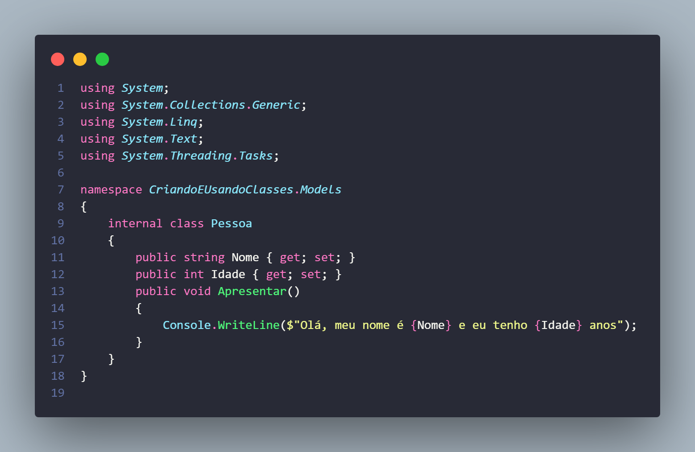
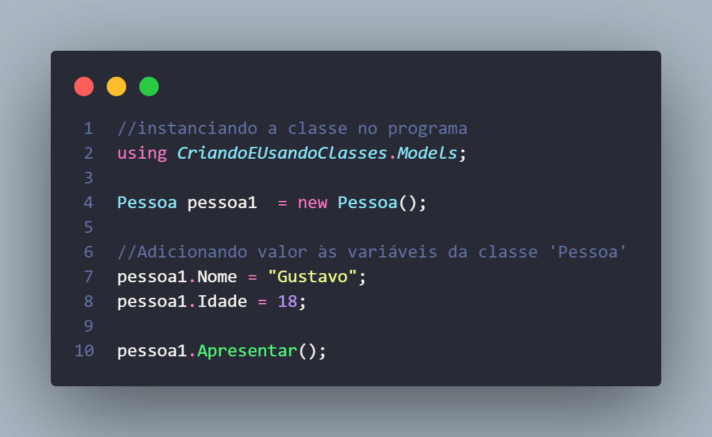

# Estou usando esse repositório para guardar meus aprendizados em C#
## Criando e usando classes no C#!

### Importando a classe para o programa, instanciando-a, adicionando valores às variáveis e executando a função (método).

### Saída:

